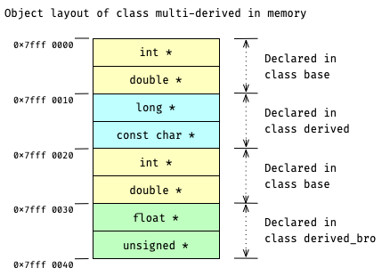

# Memory Layout in Multiple Inheritance

在 multiple inheritance 的情况下, multi-derived object memory layout 将由两部分组成:
- part 1. 是其所有 base objects 的 memory layout 按照 inherit 的顺序依次拼接在一起;
- part 2. 是其自己的 member variables 按照 declared 的顺序依次追加在 part 1 之后.

举例来说.
接着上一节的例子, 再定义一个 `class multi_derived`.
死者之间的 inheritance 关系将如下所示:
```c++
class base;
class derived : public base;
class derived_bro : public base;
// new: multiple inherited
class multi_derived 
        : public derived
        , public derived_bro;
```
对于这里的 `class multi_derived`
[(*here*)](psi_element://__only_for_anchor_used__memory_layout_multi_derived),
它的 memory layout 如下:



**注意观察!!** 
`class multi_derived` 会**完整**复制并拼接来自 `class derived` 和 `class derived_bro` 的 memory layout.
"**完整**" 意味着在 `class multi_derived 的 object layout 中将有两份` class base 的 memory layout (图中<span style="background: #feffbf; color: black"> 黄色 </span>的区域)!

### Run the Demo

试试运行这里的
[demo for class multi_derived](psi_element://MultipleInheritanceMemoryLayout_MultiDerivedMemoryLayout_Test),
它会直接打印 `class multi_derive` 的 memory layout 到 console.
请仔细观察代码与输出的 memory layout, 并尝试与上面的示意图一一对应~
