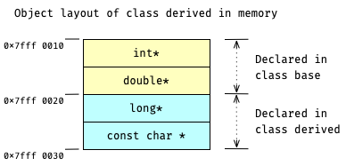
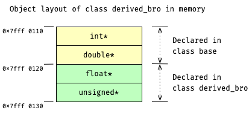

# Memory Layout in Single Inheritance

没有 inheritance 时, object 内 member variables 的排列参照 [task Member Variable Layout](course://Classes/Non_Static_Member_Variables/Layout).

而在 single inheritance 的情况下, derived object 的 memory layout 由两部分组成:
- part 1. 是 base object 的 memory layout;
- part 2. 是其自己的 member variables 按照 declared 的顺序依次追加在 part 1 之后.

举例来说.
定义三个 classes: `class base` [(*here*)](psi_element://__only_for_anchor_used__memory_layout_base) 
`class derived` [(*here*)](psi_element://__only_for_anchor_used__memory_layout_derived), 与 
`class derived_bro` [(*here*)](psi_element://__only_for_anchor_used__memory_layout_derived).
三者之间的 inheritance 关系很简单, 如下所示:
```c++
class base;
class derived : public base;
class derived_bro : public base;
```
对于这里的 `class derived`
[(*here*)](psi_element://__only_for_anchor_used__memory_layout_derived),
它的 memory layout 如下:



与此类似, `class derived_bro`
[(*here*)](psi_element://__only_for_anchor_used__memory_layout_derived_bro),
的 memory layout 如下所示:



### Run the Demo

试试运行这里的
[demo for class derive](psi_element://SingleInheritanceMemoryLayout_DerivedMemoryLayout_Test) 和
[demo for class derive_bro](psi_element://SingleInheritanceMemoryLayout_DerivedBroMemoryLayout_Test),
它们会直接打印 `class derive` 和 `class derive_bro` 的 memory layout 到 console.
请仔细观察代码与输出的 memory layout, 并尝试与上面的示意图一一对应~
