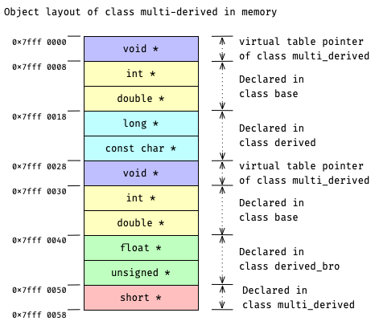

# Revisit Memory Layout in Multiple Inheritance

与 single inheritance 的情况类似:
在 multiple inheritance 情况下, 当拥有 `virtual` table 时, derived object 的 memory layout 会因为 virtual table 而有轻微变化:
- 整体 object layout 会往高地址方向移位 8 个字节 (64-bit 系统下);
- 空出来的这 8 个字节存储着指向 object's virtual table 的 pointer.

沿用
[task Memory Layout in Multiple Inheritance](course://Classes/Inheritance/Multiple_Inheritance_Memory_Layout)
里的例子, 只不过这次为 base `class base`
[(*here*)](psi_element://__only_for_anchor_used__memory_layout_multi_base_with_vtable)
和 derived `class derived, class derived_bro, class multi_derived`
[(*here*)](psi_element://__only_for_anchor_used__memory_layout_multi_derived_with_vtable)
添加了 virtual member functions.
四者之间的 inheritance 关系依旧, 如下所示:
```c++
class base;
class derived : public base;
class derived_bro : public base;
class multi_derived : public derived, public derived_bro;
```

## Memory Layout of Multiple Derived Class

此时, `class multi_derived`
[(*here*)](psi_element://__only_for_anchor_used__memory_layout_multi_derived_with_vtable)
的 memory layout 将如下:



由上可知, multiple derived memory layout 是由其 base classes 的 memory layouts 按照 inheritance 的顺序拼接而成, 
最后在 layout 的末尾追加新添的 member variables.

### Run the Demo

试试运行这里的
[demo for class multi_derive](psi_element://RevisitMultipleInheritanceMemoryLayout_MultiDerivedMemoryLayout_Test)
它会直接打印 `class multi_derive` 的 memory layout 到 console.
请观察代码与输出的 memory layout, 并尝试与上面的示意图一一对应~

## Virtual Tables of Multiple Derived Class

如下图所示, multiple derived object 内会有两个 virtual table pointers (图中<span style="background: #bfbfff; color: black"> 紫色 </span>的区域):


这两个 virtual tables 分别是从对应 base class 的 virtual table 派生而来.
每个 virtual table 的构建方式与 
[task Virtual Table](course://Classes/Polymorphic/Virtual_Table) 里介绍的基本一致, 即 1) *copy*, 2) *override*, 3) *extend*.
唯一的区别是:
- *extend* 只发生在第一个 virtual table 的构建过程中, 剩下的 virtual tables 都只有 *copy* 和 *override* 这两个步骤;

由于 multi_derived class 有不止一个 base classes, 在 *extend* 第一个 virtual table 时, 追加的 member functions:
  - 包括还未添加的 override member functions (如 `gee()` );
  - 包括只在当前 class (`class multi_derived`) 里 defined 的 member functions (如 `haa()` )

## Non-Virtual Thunk to Member Function

### 什么是 thunk?

> A thunk usually refers to a small piece of code that is called as a function, does some small thing,
> and then JUMPs to another location (usually a function) instead of returning to its caller. Assuming
> the JUMP target is a normal function, when it returns, it will return to the thunk's caller.
> -- by [Chris Dodd on stackoverflow.com](https://stackoverflow.com/a/2641975/11192045)

按我的理解, 翻译如下: 
thunk 通常是一小段没有 return 的代码, 可以像正常 function 一样被调用. 
它在做一些简单的操作后, 会直接 jump 到另外一个位置继续执行.
若 jump 至一个 function, 那么当这个 function returns 时, 会直接 return 到调用 thunk 的地方.

更简单地说, thunk 用于包装一个 function, 它先执行一小段给定的代码, 再执行目标 function.
这个 function 可以仅仅是一个 jump 指令.

### Thunk 在 C++ 里的作用是什么?

> virtual function handling -- when calling a virtual function of a multiply-inherited base class 
> in C++, there needs to be a fix-up of the this pointer to get it to point to the right place. 
> A thunk can do this.
> -- by [Chris Dodd on stackoverflow.com](https://stackoverflow.com/a/2641975/11192045)

翻译过来就是说: 在 multiple-inherited 的情况下, 需要先修复 base pointer 的位置, 然后才能正确地访问它的 virtual member function.

为什么要修复 base pointer 呢?
承接上例, 当将一个 derived pointer (of type `multi_derived *`) 向上转换成 base pointer (of type `derived_bro *`) 时, pointer 会向高地址偏移至 derived_bro part 的起始处.
修复 base pointer, 就是让偏移的 base pointer 重新指向原始的地址.
只有这样, virtual member function 才可正确地解析 object memory layout.

而 virtual table #2 中的 `multi_derived::gee()` 就是这样一个 thunk: a non-virtual thunk to member function `multi_derived::gee()`. 
