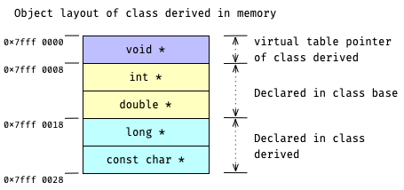
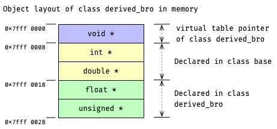
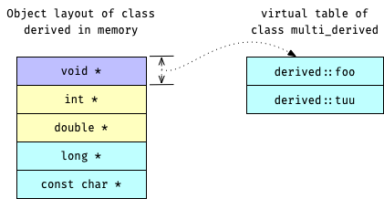
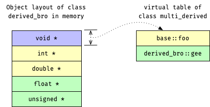

# Revisit Memory Layout in Single Inheritance

在 single inheritance 情况下, 当 base class 拥有 `virtual` member function 时, derived object 的 memory layout 会因为 virtual table 而有轻微变化:
- 整体 object layout 会往高地址方向移位 8 个字节 (64-bit 系统下);
- 空出来的这 8 个字节存储着指向 object's virtual table 的 pointer.

沿用
[task Memory Layout in Single Inheritance](course://Classes/Inheritance/Single_Inheritance_Memory_Layout) 
里的例子, 只不过这次为 base `class base`
[(*here*)](psi_element://__only_for_anchor_used__memory_layout_base_with_vtable)
和 derived `class derived, class derived_bro`
[(*here*)](psi_element://__only_for_anchor_used__memory_layout_derived_with_vtable)
添加 virtual member functions.
三者之间的 inheritance 关系依旧, 如下所示:
```c++
class base;
class derived : public base;
class derived_bro : public base;
```

## Memory Layout of Derived Classes

此时, `class derived`
[(*here*)](psi_element://__only_for_anchor_used__memory_layout_derived_with_vtable)
的 memory layout 将如下:



与此类似, `class derived_bro`
[(*here*)](psi_element://__only_for_anchor_used__memory_layout_derived_bro_with_vtable)
的 memory layout 将如下所示:



当对应 class 中有 virtual member function 时, object layout 的前端就会多一个 8 字节的 pointer
(图中<span style="background: #bfbfff; color: black"> 紫色 </span>的区域) 指向当前 object 的 virtual table.

## Virtual Tables of Derived Classes

对于一个拥有 virtual table 的 class, 它的所有 objects 共享这一个 virtual table.
也就是说, 对于来自同一个 polymorphic class 的 objects, 它们的 virtual table pointers 都指向同一个 virtual table.

在 `class derived` 的 virtual table 中, 来自 `class base` 的 `foo()` 被 override, 如下图所示:



`class derived_bro` 的 virtual table 如下图所示:



## Pointer Type Conversion between Inheritance Hierarchy

Pointer type conversion 只是用新的 type 来解读旧 pointer 所指向的 memory, 期间并不会改变现有的 memory, 更不会调用任何 type conversion operator 或 type conversion constructor.

因此,
"如
[demo](psi_element://VirtualPureSpecifier_Virtual_Test)
中通过 base type 的 pointer 访问 virtual member function 时可以正确地调用 derived object 的 member function"
这种现象也有了答案:
> 我们在将 derived pointer 转换成 base type 时并没有改变 virtual table, 因此 dynamic dispatch 仍会从 derived virtual table 中帮我们定位 virtual member function.

此外, 我们应该还可以理解:
- 将 derived type 的 pointer 转换成 base type 是 memory layout 安全的 
  因为 derived memory layout 包含了 base memory layout (如上示意图)
- 反之, 将 base type 的 pointer 转换成 derived type 是不安全的

### Run the Demo

试试运行这里的
[demo for class derive](psi_element://RevisitSingleInheritanceMemoryLayout_DerivedMemoryLayout_Test) 和
[demo for class derive_bro](psi_element://RevisitSingleInheritanceMemoryLayout_DerivedBroMemoryLayout_Test),
它们会直接打印 `class derive` 和 `class derive_bro` 的 memory layout 到 console.
请观察代码与输出的 memory layout, 并尝试与上面的示意图一一对应~
