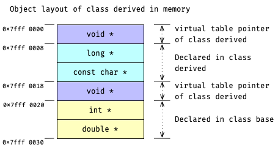

# Virtual Inheritance

Virtual inheritance 会自动合并来自两个 base class 的 members, 若合并失败则以报错的形式要求程序员显式地解决冲突.
自动合并只能合并 same name and same type 的 member variables.

沿用
[task Revisit Multiple Inheritance Memory Layout](course://Classes/Polymorphic/Revisit_Multiple_Inheritance_Memory_Layout)
里的例子.
只不过这次采用 virtual inheritance
[(*demo*)](psi_element://__only_for_anchor_used__virtual_inheritance)
, 则 memory layout 与 virtual table 将如下所示.

## Memory Layout of Virtual Inherited Object

与 non-virtual inheritance 不同, 当 virtual inheritance 时 base part 会被置于 layout 底部.
此时, `class derived` 的 memory layout 将如下:

`class derived_bro` 的 memory layout 将如下:

当 multiple inherit 两个 virtual inherited base classes 时, compiler 会自动合并能够合并的 members.
如 `class multi_derived` 的 memory layout, base part 已被合并, 而且被置于 layout 底部:

## Virtual Table of Virtual Inherited Object

Virtual inheritance 的情况下, 会比之前的情况多出一个 virtual table.
这个多出来的 virtual table 派生于 `class base`.

由于 member functions 不会自动合并, 上一个例子中冲突的 member function `foo()` 必须手动 override.
而对于 member function `kii()`, 因为只有一份 (`base::kii()`), 所以就没必要 override 它了.

这样一来, `class multi_derived` 所有的 virtual tables 中的 member functions 将保持统一.
因为不统一的话, compiler 会报错并要求显式地 override, 从而变成统一. 
如下图所示:

