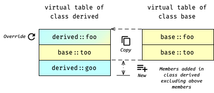

# Virtual Table -- The Secret of C++'s Polymorphism

Virtual table 根据 wiki 的定义:
> A *virtual method table (VMT)*, *virtual function table*, *virtual call table*, *dispatch table*,
> *vtable*, or *vftable* is a mechanism used in a programming language to support dynamic dispatch
> (or run-time method binding) *-- referenced from [wiki](https://en.wikipedia.org/wiki/Virtual_method_table)*.

## Layout of Virtual Table

本质上, virtual table 就是一个存储着 member function pointers 的 array.
在 compilation 期间, compiler 会为拥有 virtual function 的每一个 class 都创建一个唯一与之对应的 virtual table.
这个 class 所有的 objects 共享这一个 virtual table.
而 virtual table 里存着的 pointers, 实际上就指向对应 class 里的 virtual member functions.

另外, Type-compatible 的 classes 的 virtual table 拥有相似的 layout, 即:
拥有相同名称的 virtual member functions 会分别出现在对应 virtual table 相同的 index 处.

### A Layout Example

举个例子, 对于这里的 `class base`
[(*here*)](psi_element://__only_for_anchor_used__virtual_table_base_exmaple)
和 `class derived`
[(*here*)](psi_element://__only_for_anchor_used__virtual_table_derived_exmaple),
它们的 virtual table 如下:

上图 table 中存储着的都是对应的 function pointers.
我们可以观察到:
- 由于 derived class 并没有 override base class 的 `too()`, 在 derived virtual table 中 `too()` 依然指向的是 base class 里的 `too()`;
- 所有 virtual member functions 都在对应的 virtual tables 中, 而 normal member function `hoo()` 则不在其列
- 同名的 virtual member functions 在对应的 virtual table 中的 index 都相同, 
  如 `foo()` 在两个 virtual table 中都处于 index `0` 处, 而 `too()` 则都处于 index `1` 处

## Dynamic Dispatch through Virtual Table

一般 function 或 member function 的调用会被编译成指令 `call 0x????`, 其中 `0x????` 直接对应了 function address.

而 virtual member function 则有所不同, 它的 function address 是从 object 的 virtual table 中固定的 index 处动态地获取的.
这也被称为 dynamic dispatch.
正因如此, 当一个 base pointer 指向不同 derived objects 时, 才有可能根据 object 的不同而调用不同的 member function.

现在, 我们应该可以回答下面的一些问题了:
1. 为什么不加 specifier `virtual` 的 member function 没有 polymorphic 特性呢?
    - 试答: 因为不加 `virtual` 就不是 virtual member function, 也就不会出现在 virtual table 中;
2. C++ 中的 polymorphism 是如何实现的呢?
    - 试答: 通过 virtual table 实现 dynamic dispatch
