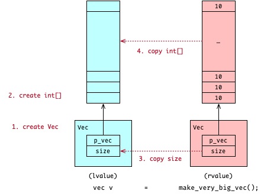
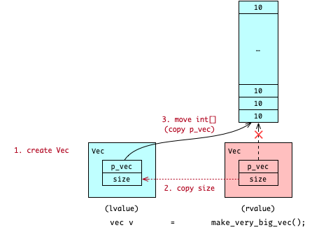

# Left Value and Right Value

总结
[task](course://Expressions/Value/Value_Categories) 
来说, lvalue 是那些拥有 name 且 not-expired 的 value;
而 rvalue 是那些没有 name 或已经 expired 的 value.

仅仅了解 lvalue 和 rvalue 的定义还不够, 我们现在来看看它们的一些特性:

lvalue 
- lifetime 受 coder 控制, 可以是整个 program 的 lifetime;
- 持久存在于 memory, coder 可以通过 `operator&` 来获取 lvalue 的 memory address;
- 有 name, 可被 coder 多次直接访问 (读取或修改);
  大部分的 lvalue 是以 variables 的形式存在, 就是为了方便 coder 多次使用
- 可通过 `std::move` 将 non-const lvalue 转换成 rvalue

rvalue 
- lifetime 只由 compiler 决定, 且通常在当前 expression 结束后就被立即销毁;
- 只临时存在于 memory, 在执行控制权交给 coder 之前, rvalue 就已经被销毁; 
  因此 coder 不可以获取 rvalue 的 memory address;
- 没有 name, 不可被 coder 直接访问 (读取或修改);
  大部分的 rvalue 是一次性的 temporaries, 被 compiler 用来存储 intermediate results of evaluation 的
- 可通过 rvalue-reference 将 rvalue 转换成 lvalue

## Why to distinguish lvalue from rvalue? 

其实在 C++11 之前 lvalue 和 rvalue 的概念还没这么重要, coder 只能也只需要接触到 lvalue.
但是 rvalue 的存在确实能给 coder 提供更多优化的可能性.

考虑下面这个例子 (完整的代码在 [demo](psi_element://LValueRValue_RValueAvoidCopy_Test) 里):

```c++
struct vec {
    // implement the vector
    int *p_arr;
};

vec make_very_big_vec() { /*...*/}

vec v = make_very_big_vec();
```

上面这个例子在项目中非常常见.
通过一个 function `make_very_big_vec()` 创建一个非常大的 object 并 return,
然后用 returned object 来 initialize 一个 local variable `v`.

在没有 rvalue 概念的情况下, initialization 时会调用 `class vec` 的 copy constructor,
来把 returned object 的 content 赋给 variable v.
这个 copy 的操作会因为非常大的 object 而变得非常耗时.
如下图所示, 图中<span style="background: FFBFBF; color: black"> 红色 </span>表示 initialization 后会被 destroyed,
而<span style="background: BFFFFF; color: black"> 蓝色 </span>则表示会被留下:



然而, 我们清楚地知道这个 returned object 是一个 rvalue, 它在被用于 initialization 后就会被立即销毁.
既然 returned object 会被销毁, 最有效率的 initialization 是直接拿走 (而不是 copy) returned object 里的 data.
如上例中, 直接只 copy 那个 returned object 里的 `p_vec` 和 `size`.
这样就可以避免不必要的且耗时的 copy 操作.
如下图所示, 省去了创建和复制非常大数组的操作:



那具体应该怎么实现呢?
通过
[overloading](course://Functions/Overloading)
技术, 我们就可以区分开 lvalue 和 rvalue, 然后对它们采取不同的操作了.
而对于这里的例子, 我们是通过 overload
[move constructor](psi_element://__only_for_anchor_used__lrvalue_move_constructor)
来处理这个问题的.

你可以运行
[demo](psi_element://LValueRValue_RValueAvoidCopy_Test)
来看看它调用了哪个 constructor.
你也可以注释掉
[move constructor](psi_element://__only_for_anchor_used__lrvalue_move_constructor)
后再运行依次,
这次再看看它又是调用了哪个 constructor.
